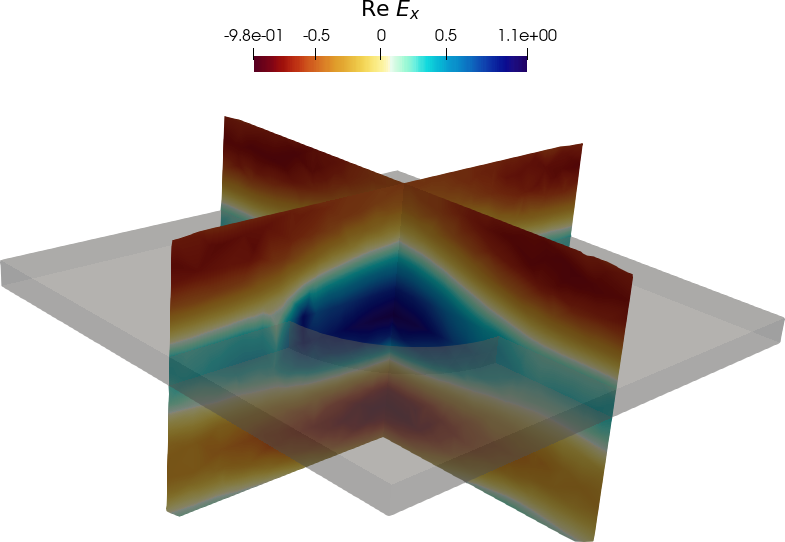

.. image:: https://gitlab.com/gyptis/gyptis/badges/master/pipeline.svg?style=flat-square
   :target: https://gitlab.com/gyptis/gyptis/commits/master
   :alt: pipeline status

.. image:: https://gitlab.com/gyptis/gyptis/badges/master/coverage.svg?style=flat-square
  :target: https://gitlab.com/gyptis/gyptis/commits/master
  :alt: coverage report

.. image:: https://img.shields.io/github/license/mashape/apistatus.svg?style=flat-square
   :alt: Licence: MIT

.. image:: https://img.shields.io/badge/code%20style-black-000000.svg?style=flat-square
   :alt: Code style: black

GYPTIS
======

Computational photonics in Python
---------------------------------

https://gyptis.gitlab.io

Gyptis is a package to solve Maxwell's equations with the finite element method. 
It is in early stage and currently being actively developed, so features might 
come and go.

Installation
------------

.. `pip <https://pip.pypa.io/en/stable/>`_
.. ~~~~~~~~~~~~~~~~~~~~~~~~~~~~~~~~~~~~~~~
.. 
.. .. code-block:: bash
.. 
..   pip install gyptis
.. 
.. 
.. `conda <https://docs.anaconda.com/>`_
.. ~~~~~~~~~~~~~~~~~~~~~~~~~~~~~~~~~~~~~
.. 
.. .. code-block:: bash
.. 
..   conda install -c conda-forge gyptis

Docker
~~~~~~

Prebuilt container images are available at `DockerHub <https://hub.docker.com/r/gyptis/gyptis>`_

On quick way of testing is getting the installation script

.. code-block:: bash

  curl -s https://gyptis.gitlab.io/get | bash

Or you can pull the docker image

.. code-block:: bash

  docker pull gyptis/gyptis:latest

Contributing
------------

Pull requests are welcome. For major changes, please open an issue first 
to discuss what you would like to change.

Please make sure to update tests as appropriate.

License
-------

MIT, see LICENCE.txt
